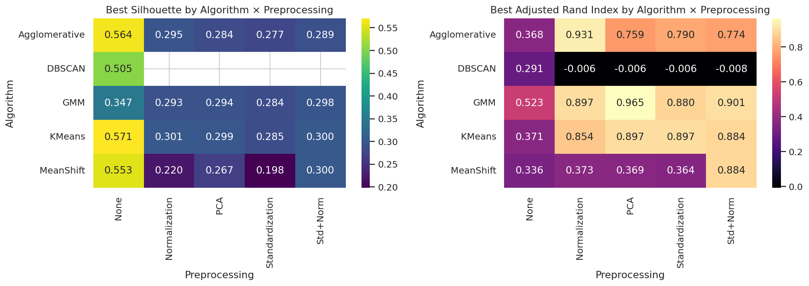

# Comparative Performance Study of Clustering Algorithms

A comparative analysis of five clustering algorithms across five preprocessing pipelines and three cluster counts, evaluated on four different metrics — applied to the UCI **Wine** dataset.

## Overview

| Axis | Values |
|---|---|
| **Algorithms (5)** | KMeans · Agglomerative (Ward) · DBSCAN · MeanShift · Gaussian Mixture |
| **Preprocessing (5)** | None · MinMax Normalization · Standardization · PCA (95% var) · Std + Normalize |
| **k values** | 3, 4, 5 *(skipped for DBSCAN / MeanShift, which auto-select)* |
| **Metrics** | Silhouette ↑ · Calinski–Harabasz ↑ · Davies–Bouldin ↓ · Adjusted Rand Index ↑ |

**Total configurations evaluated:** 55

## Dataset

[**UCI Wine**](https://archive.ics.uci.edu/dataset/109/wine) — 178 samples, 13 chemical features, 3 cultivars. Chosen because:
- Feature scales differ by ~1000× (e.g. `proline` vs `nonflavanoid_phenols`), so preprocessing visibly matters.
- Ground-truth cultivar labels enable supervised evaluation alongside internal metrics.

## Results

### Best score per (Algorithm × Preprocessing) — Silhouette and ARI



### Top 5 configurations by each metric

| Metric | Winner | Algorithm | Preprocessing | k | Silhouette | ARI |
|---|---|---|---|---|---|---|
| **Silhouette** ↑ | #1 | KMeans | None | 3 | **0.571** | 0.371 |
| **Calinski–Harabasz** ↑ | #1 | KMeans | None | 5 | 0.549 | 0.312 |
| **Davies–Bouldin** ↓ | #1 | DBSCAN | None | auto | 0.505 | 0.291 |
| **Adjusted Rand Index** ↑ | #1 | **GMM** | **PCA** | **3** | 0.294 | **0.965** |

### Cluster recovery: ground truth vs winner-by-Silhouette vs winner-by-ARI


### Silhouette vs k for partitioning algorithms


### Silhouette vs Davies–Bouldin trade-off across all 55 configurations


## Key findings

1. **Preprocessing dominates algorithm choice.** KMeans goes from ARI 0.37 (raw) to 0.90 (PCA) without changing the algorithm.
2. **Internal metrics can mislead.** The Silhouette champion — KMeans on raw data — is one of the *worst* configurations by ground truth (ARI 0.37). On unscaled Wine, distances are dominated almost entirely by `proline`, producing geometrically tight but semantically wrong clusters.
3. **Best overall: GMM + PCA + k=3** (ARI 0.965). Standardization equalizes the 13 chemical measurements; PCA decorrelates them; GMM captures the elongated, anisotropic shape of each cultivar that KMeans's spherical clusters can't.
4. **DBSCAN is the wrong tool here.** After scaling, ARI ≈ 0 — the cultivars sit at uniform density in 13D, so there are no density gaps for DBSCAN to find.
5. **k = 3 is robustly correct** under ARI, but Calinski–Harabasz often prefers k = 4 or 5. When you have ground-truth labels, use them.

## Files

| File | Description |
|---|---|
| `Clustering_Comparative_Study.ipynb` | Main Colab-ready notebook with all code, narrative, and embedded outputs |
| `clustering_results.csv` | All 55 configurations × all metrics — raw data for the tables and plots |
| `outputs/heatmap_metrics.png` | Algorithm × Preprocessing heatmap (Silhouette + ARI) |
| `outputs/silhouette_vs_k.png` | Faceted bar plot of Silhouette vs k by preprocessing |
| `outputs/pca_scatter_comparison.png` | Side-by-side cluster recovery in PCA space |
| `outputs/tradeoff_scatter.png` | Silhouette vs Davies–Bouldin per configuration |

## How to run

```bash
pip install scikit-learn pandas numpy matplotlib seaborn jupyter
jupyter notebook Clustering_Comparative_Study.ipynb
```

Or open `Clustering_Comparative_Study.ipynb` directly in Google Colab — no local setup required.

## Conclusion

When clustering tabular data with mixed feature scales: **standardize first, try GMM in addition to KMeans, use multiple evaluation metrics, and validate against any labels you have**. PCA before clustering is essentially a free win when features are correlated. Internal metrics are necessary but not sufficient — they measure geometric quality, not semantic correctness.
